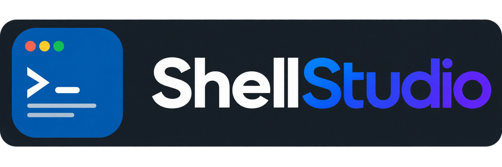

<div align="center">

</div>

Shell Studio is a standalone Linux terminal workspace for local terminals, WSL and SSH.
Persistent consoles live in a private tmux server. Bubble Tea provides views,
the file explorer, global Notes, extension management and forms.

License: GPL-3.0-only. Bundled agent-chat and agent-gantt packages retain MIT.
External programs have their own licenses. No agent installation is required.

## Install

On Linux or WSL2 (amd64/arm64):

```sh
curl -fsSL https://raw.githubusercontent.com/TobiasCoding/ShellStudio/main/scripts/install.sh | sh
```

The installer downloads the latest stable GitHub Release, verifies its SHA-256
checksum and version, and installs `shellstudio` in `~/.local/bin`. It sets up
PATH for Bash, Zsh, Fish and POSIX login shells. Open a new terminal if that
directory was not already in PATH, or run `export PATH="$HOME/.local/bin:$PATH"`
in the current Bash/Zsh shell. You can then run `shellstudio` from any directory.

Requirements: curl, standard Linux tools (including sha256sum and flock), and
tmux 3.4+. If tmux is missing, the installer asks before using the system package
manager; this step may require sudo. No Go installation is needed. Optional MCP
installation needs Python 3.9+ with venv/ensurepip.

The one-line command requires a public repository and a published release with
Linux binaries and SHA256SUMS. A GitHub `/tree/` URL is an HTML page, not an
installer. To review the script or select a version first:

```sh
curl -fsSL https://raw.githubusercontent.com/TobiasCoding/ShellStudio/main/scripts/install.sh -o install.sh
less install.sh
sh install.sh --version v0.2.0
```

Options include `--bin-dir /absolute/directory`, `--no-path`, and `--yes` to permit
installing a missing tmux without the confirmation prompt. A custom binary
directory must already be on PATH or be added by you. Re-running the installer
replaces the executable and preserves workspace data.

## Open a folder

```sh
cd /path/to/project
shellstudio                  # Open the current directory
shellstudio .                # The same, explicitly
shellstudio /path/to/project # Open another directory
shellstudio "folder with spaces"
shellstudio --menu           # Start at the saved views menu
```

ShellStudio reuses a saved view for the folder, or creates one. Existing consoles
keep their working directories; stopped programs are not restarted automatically.
Use `shellstudio open DIRECTORY` or `shellstudio ./notes` when a folder name
matches a command such as `notes` or `update`.

## Updates

Each interactive workspace or Notes launch checks GitHub for a newer stable
release before opening the UI. When one is available, ShellStudio asks
`Install now? [y/N]`. Only an explicit yes installs it. Declining continues with
the current version; the next launch checks again. The check has a two-second
deadline and offline or rate-limited checks do not prevent startup.

```sh
shellstudio update --check   # Report availability without installing
shellstudio update           # Check and ask before installing
SHELLSTUDIO_NO_UPDATE_CHECK=1 shellstudio # Skip the startup check
```

Updates verify checksums and the executable's version, then atomically replace
the binary. Failed downloads leave the installed executable intact. After a
startup update, ShellStudio reopens with the same arguments and current directory.
Existing consoles keep running. Noninteractive commands and internal tmux helpers
do not check for updates. No extension or agent is updated by this mechanism.

## Build from source

Install Go 1.23+, tmux 3.4+ and, for the complete test suite, Python 3 with venv.
From a source checkout:

```sh
make check
make release
sh scripts/install.sh --from "$PWD/dist"
shellstudio doctor
```

The binary embeds the catalog, schema and MCP packages; it does not need its
source checkout. The offline `--from` installer verifies local release checksums
with the same checks used for downloaded binaries. See [releasing](docs/releasing.md)
for publishing versions that the installer and updater can discover.

## Workspace

Press n in Views to create a view with a base folder. Enter opens its console
list; t launches Terminal, n selects an enabled extension. A blank launch folder
uses the view's folder, then ShellStudio's launch directory. Ctrl+F opens the
folder picker; Ctrl+R shows recent folders. Existing consoles keep their folders.

Enter opens a tmux view. F6 changes panel, F4 zooms, F10 returns to the menu.
Mouse clicks focus panels; drag borders to resize. Clients have independent focus.
Closing the UI or SSH connection preserves programs. After a machine restart,
saved consoles are stopped; r explicitly relaunches one.

In the console list: f edits the view; b toggles its explorer; l selects layout;
a links an existing console; d unlinks it; [ / ] moves it; x stops its program.
The explorer supports filtering, preview, e for an external editor, r to rename,
and c to copy a path using OSC 52.

## Notes

Tab to Notes; n creates a note. Search with /, trash with d, toggle trash with t,
rename/restore with r, and export Markdown with e. The library is global.

Saving starts after 300 ms idle or at least once per second while typing.
Saved means SQLite has committed and synced the transaction. Slow storage can
extend Saving. Escape flushes before leaving. Write failures keep the editor
and its text, show the actual error, and allow retry with Ctrl+S or another edit.
Concurrent revisions create a conflict copy. Abrupt kills may lose pending edits.

## Extensions

Terminal is the only built-in program launcher. Notes is bundled and enabled.
Claude, Codex, agent-chat and agent-gantt are optional. Their catalog is always
available, even if the programs are absent.

- Enter: origin, version, dependencies and installation details.
- i: preview/install; e: enable detected program; d: disable.
- c: configure a default named profile with executable, JSON arguments and env.
- a: import a manifest from a file or HTTPS URL; n: add an existing command.
- u: uninstall and retain data; uppercase X: also request data deletion.
- m: preview MCP registration for Claude/Codex, with backup and conflict checks.
  Missing clients produce pending registration; return to m after installation.

Installation is per-user, version pinned, integrity checked and verified before
activation. No automatic extension updates or permission-bypass flags. Disabling does not
stop programs. Uninstall retains immutable packages for active consoles; see
[storage](docs/storage.md) for reclamation. The MCPs install offline into separate
Python venvs and include read-only viewers. No private sessions or data migrate.

## Diagnostics and development

    ssh HOST -t shellstudio
    shellstudio doctor
    shellstudio backup /absolute/path/backup.db
    shellstudio validate examples/htop.json
    make check
    make release

Press ? for SSH, scp, forwarding, clipboard and WSL help. OSC 52 needs support
and permission in the local terminal. Ctrl+B then [ enters tmux copy mode.

See [architecture](docs/architecture.md), [extensions](docs/extensions.md),
[storage/recovery](docs/storage.md), [security](SECURITY.md),
[contributing](CONTRIBUTING.md), [releasing](docs/releasing.md) and
[notices](THIRD_PARTY_NOTICES.md).
